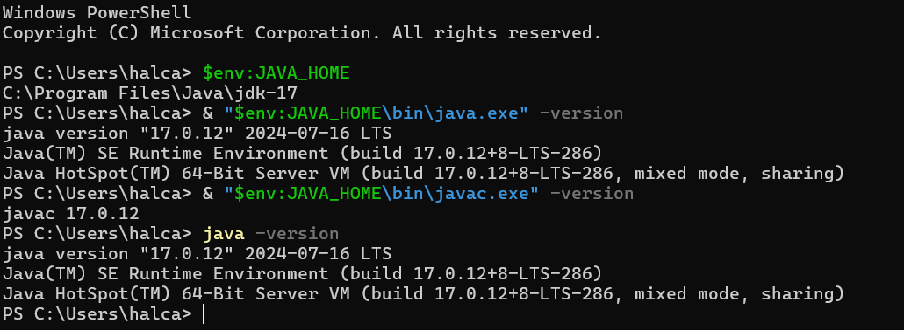
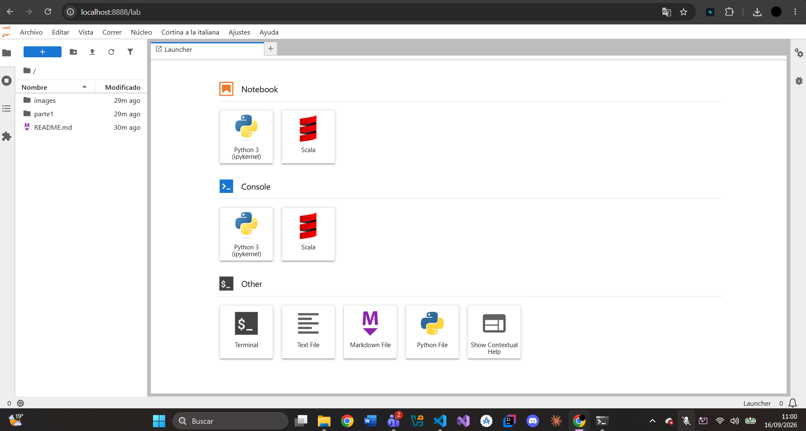
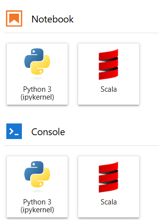
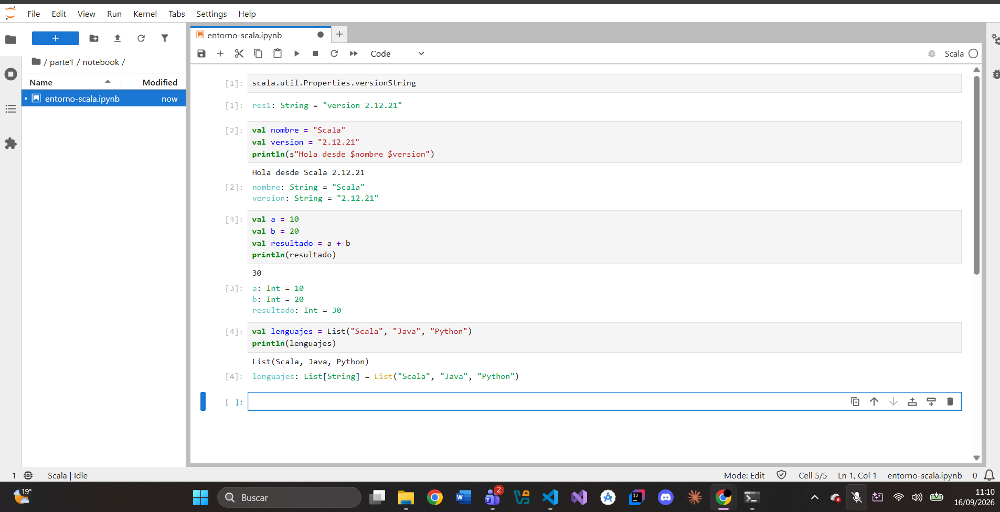
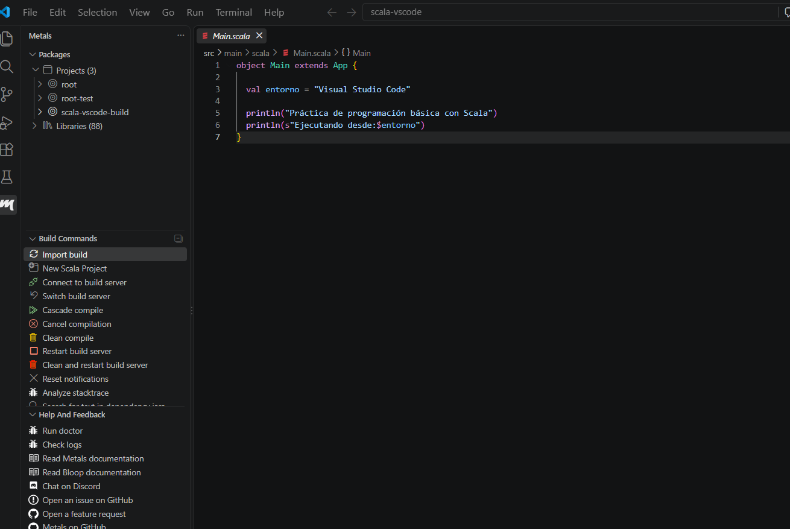
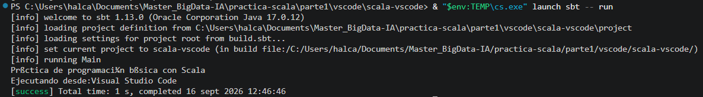

# Parte 1 — Entornos de Trabajo en Scala

## 0. Prerrequisitos del Sistema: Java JDK 17

Para garantizar la compatibilidad con Scala 2.12.21 y las herramientas de compilación (`sbt`), se requiere Java JDK 17 en Windows 11.

### Configuración e Incidencias Encontradas
1. **Conflicto inicial de versiones:** El sistema contaba previamente con OpenJDK 22, lo que impedía la correcta resolución de dependencias para Scala 2.12.
2. **Instalación de JDK 17:** Se instaló Oracle JDK 17.0.12 mediante su instalador oficial MSI.
3. **Aislamiento de entorno (`JAVA_HOME`):**
   - Para no alterar dependencias globales del sistema operativo ni desinstalar otras versiones, se configuró la variable de sistema `JAVA_HOME` apuntando a:
     `C:\Program Files\Java\jdk-17`
   - Se verificó que las llamadas directas a `%JAVA_HOME%\bin\java.exe` y `javac.exe` apunten con éxito a la versión 17.0.12.

### Evidencia de Verificación


---

## 1. Entorno 1 — JupyterLab + Almond Kernel + Scala 2.12.21

### 1.1 Descripción y Especificaciones del Entorno
Entorno interactivo tipo REPL basado en la web para experimentación ágil, prototipado y análisis de datos en Scala con Apache Spark.

* **Plataforma:** JupyterLab
* **Kernel JVM:** Almond
* **Versión de Scala fijada:** 2.12.21
* **Máquina virtual base:** Oracle JDK 17 (17.0.12)

---

### 1.2 Instalación de Componentes y Requisitos Previos

#### A. Instalación de JupyterLab
Aprovisionamiento del entorno web de cuadernos mediante el gestor `pip` de Python:

pip install jupyterlab

#### B. Aprovisionamiento de Almond mediante Coursier (`cs.exe`)
Almond es una aplicación basada en la JVM y no un paquete Python convencional. Se utilizó **Coursier**, el gestor oficial de dependencias y binarios de Scala, para descargar sus artefactos y registrarlo en Jupyter.

1. **Descarga del binario de Coursier:**
   Invoke-WebRequest -Uri "https://github.com/coursier/launchers/raw/master/cs-x86_64-pc-win32.exe" -OutFile "$env:TEMP\cs.exe"

2. **Compilación e inyección del kernel en Jupyter:**
   & "$env:TEMP\cs.exe" launch --fork almond --scala 2.12.21 -- --install

3. **Comprobación de registro de kernels:**
   jupyter kernelspec list

*Salida:* Se confirmó la presencia de la entrada `scala` bajo el directorio `%APPDATA%\jupyter\kernels\scala`.

---

### 1.3 Incidencias Técnicas y Resolución de Dependencias

* **Incidencia de resolución en Maven Central (`404 Not Found`):**  
  * **Problema:** Al ejecutar la instalación fijando una versión concreta de Almond mediante `almond:0.13.14 --scala 2.12.21`, Maven Central rechazó la petición por no existir un binario precompilado de esa versión de Almond para el parche específico `2.12.21` (`sh.almond:scala-kernel_2.12.21:0.13.14`).
  * **Solución aplicada:** Se ejecutó el aprovisionamiento delegando la resolución de la versión de Almond en Coursier con `--fork almond --scala 2.12.21`. Esto permitió compilar y descargar dinámicamente las librerías compatibles junto con el paquete oficial `scala-compiler-2.12.21.jar`.

---

### 1.4 Evidencias de Configuración y Ejecución

#### 1. JupyterLab y Kernel Almond Disponible



#### 2. Ejecución del Cuaderno de Pruebas
Se creó el notebook [`parte1/notebook/entorno-scala.ipynb`](notebook/entorno-scala.ipynb) para validar la versión exacta y las operaciones básicas del lenguaje.



---

## 2. Entorno 2 — Visual Studio Code + Metals + sbt

### 2.1 Descripción y Especificaciones
Entorno de desarrollo basado en VS Code utilizando el servidor de lenguaje **Metals** y la herramienta de gestión y compilación **sbt**.

* **IDE:** Visual Studio Code (con extensiones *Scala (Metals)* y *Scala Syntax*)
* **Herramienta de compilación:** sbt (versión gestionada vía Coursier)
* **Versión de Scala fijada:** 2.12.21
* **Entorno de ejecución JVM:** Oracle JDK 17 (17.0.12)

---

### 2.2 Configuración del Proyecto y Resolución de Incidencias

#### A. Creación de la estructura del proyecto
Se generó la estructura base utilizando el template oficial de sbt mediante el lanzador dinámico de Coursier adaptado al entorno de Windows:

& "$env:TEMP\cs.exe" launch sbt -- new scala/scala-seed.g8

*(Nombre asignado al proyecto: `scala-vscode`)*

#### B. Incidencias Técnicas y Soluciones Aplicadas

1. **Conflicto de versiones con el JDK global:**
   * **Problema:** Al intentar invocar sbt, el sistema intentaba por defecto usar OpenJDK 22, lo cual provocaba excepciones de incompatibilidad con las librerías internas de Scala 2.12.
   * **Solución aplicada:** Se fijó explícitamente la variable de entorno `JAVA_HOME` a la ruta del JDK 17 y se antepuso en la sesión de terminal activa:
     
     $env:JAVA_HOME="C:\Program Files\Java\jdk-17"
     $env:Path="$env:JAVA_HOME\bin;$env:Path"
     

2. **Invocación de sbt mediante Coursier (`cs launch`):**
   * **Problema:** Debido a las restricciones de variables de entorno globales en Windows 11, el comando directo `sbt` no siempre se quedaba registrado de forma persistente en el `PATH` de la terminal de VS Code.
   * **Solución aplicada:** Se estandarizó la ejecución de los comandos de sbt a través del lanzador dinámico de Coursier asegurando el contexto de Java 17:
     
     & "$env:TEMP\cs.exe" launch sbt -- compile
     & "$env:TEMP\cs.exe" launch sbt -- run
     

3. **Configuración del archivo `build.sbt`:**
   Se adaptó el archivo de configuración para fijar de manera estricta la versión requerida por la práctica:
   
   scalaVersion := "2.12.21"
   name := "scala-vscode"
   

---

### 2.3 Evidencias de Configuración y Ejecución

#### 1. Proyecto reconocido por Metals en VS Code


#### 2. Compilación y Ejecución Correcta


### 2.1 Descripción y Especificaciones
Entorno de desarrollo basado en VS Code utilizando el servidor de lenguaje **Metals** y la herramienta de gestión y compilación **sbt**.

* **IDE:** Visual Studio Code (con extensiones *Scala (Metals)* y *Scala Syntax*)
* **Herramienta de compilación:** sbt (versión gestionada vía Coursier)
* **Versión de Scala fijada:** 2.12.21
* **Entorno de ejecución JVM:** Oracle JDK 17 (17.0.12)

---

### 2.2 Configuración del Proyecto y Resolución de Incidencias

#### A. Creación de la estructura del proyecto
Se generó la estructura base utilizando el template oficial de sbt mediante el lanzador dinámico de Coursier adaptado al entorno de Windows:
```powershell
& "$env:TEMP\cs.exe" launch sbt -- new scala/scala-seed.g8