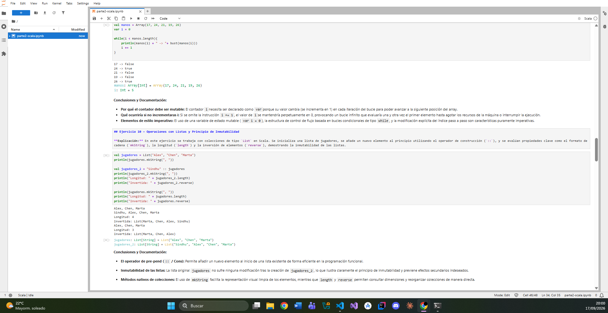
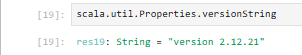
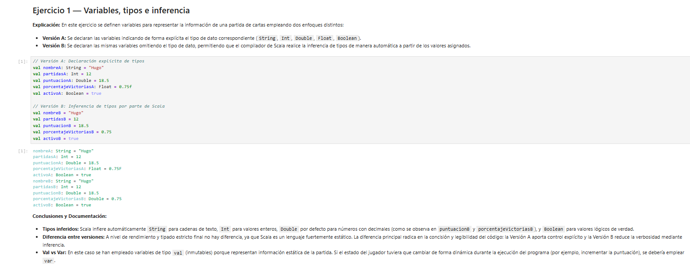
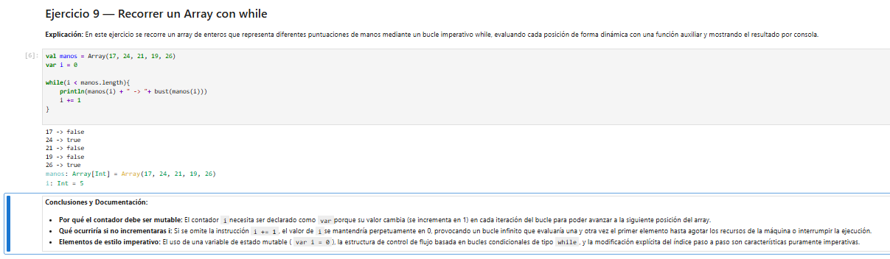
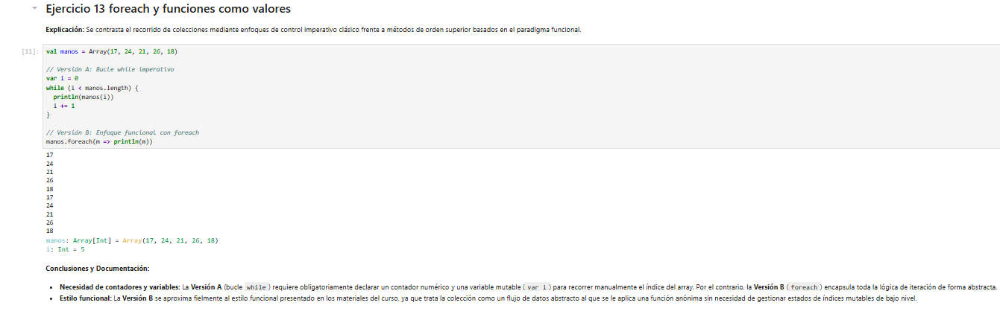
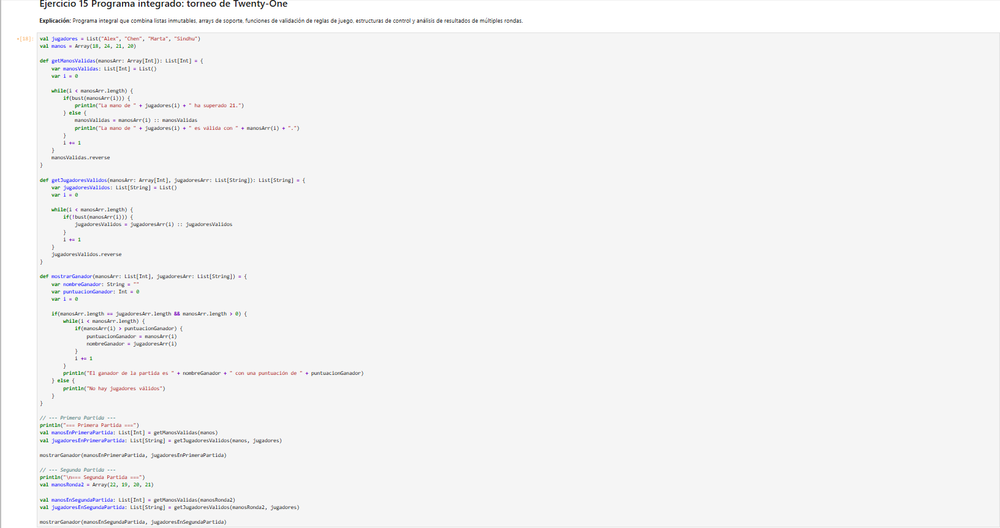
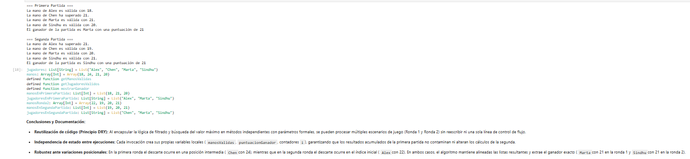

# Práctica 1 - Parte 2: Programación con Scala en JupyterLab

Documentación, evidencias y desarrollo de ejercicios prácticos sobre el lenguaje Scala ejecutados en un entorno interactivo con Almond y JupyterLab.

---

## 1. Entorno de Ejecución

* **Plataforma:** JupyterLab
* **Kernel:** Almond
* **Lenguaje y Versión:** Scala 2.12.21
* **Paradigma aplicado:** Programación imperativa inicial evolucionando hacia programación funcional (inmutabilidad, colecciones y modularidad).

---

## 2. Estado del Desarrollo de Ejercicios

- [x] **Ejercicio 1:** Variables, tipos e inferencia
- [x] **Ejercicio 2:** `val`, `var` y reasignación de identificadores
- [x] **Ejercicio 3:** Tipos numéricos y precisión en operaciones aritméticas
- [x] **Ejercicio 4:** Función para evaluar si una mano se pasa de 21 (`isHandBust`)
- [x] **Ejercicio 5:** Función de comparación de manos (`maxHand` con gestión de empate)
- [x] **Ejercicio 6:** Función para decidir el ganador de una partida (`ganador`)
- [x] **Ejercicio 7:** Arrays y mutabilidad (con manejo deliberado de errores tipados)
- [x] **Ejercicio 8:** Creación e inicialización de Arrays y uso de `.length`
- [x] **Ejercicio 9:** Recorrer un Array con bucle imperativo `while`
- [x] **Ejercicio 10:** Operaciones con Listas, operador `::` e inmutabilidad
- [x] **Ejercicio 11:** Transformación de colecciones y formato con `.mkString`
- [x] **Ejercicio 12:** Estructuras condicionales avanzadas y evaluación de expresiones
- [x] **Ejercicio 13:** Búsqueda y filtrado secuencial en colecciones
- [x] **Ejercicio 14:** Integración de métodos auxiliares sobre colecciones
- [x] **Ejercicio 15:** Filtrado modular, ejecución multirronda y algoritmo de determinación de ganador

---

## 3. Evidencias de Ejecución

### Entorno y Versión del Kernel
Demostración de JupyterLab en funcionamiento con el kernel Almond y Scala 2.12.21:





---

### Ejecución de Ejercicios Representativos

#### Ejercicio 01 — Variables, Tipos e Inferencia


#### Ejercicio 09 — Recorrido de Colecciones con Bucle While


#### Ejercicio 13 — Filtrado y Validación


---

### Ejercicio 15 — Flujo Completo Multirronda
Ejecución del algoritmo integral con dos partidas consecutivas, filtrado dinámico de manos e indexación paralela de jugadores:

**Parte 1**


**Parte 2**


---

## 4. Instrucciones para Reproducir el Notebook

1. Iniciar JupyterLab con el kernel de Almond instalado:
   ```bash
   jupyter lab
